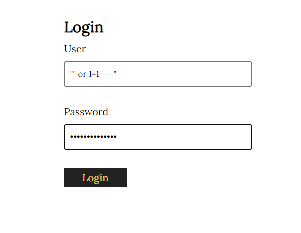
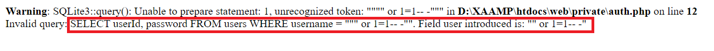
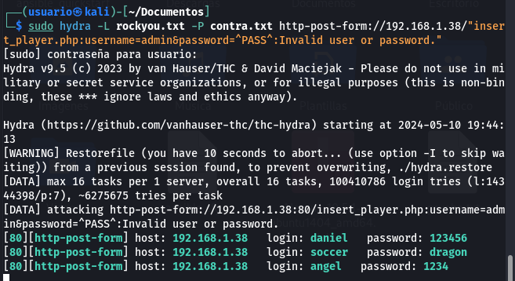
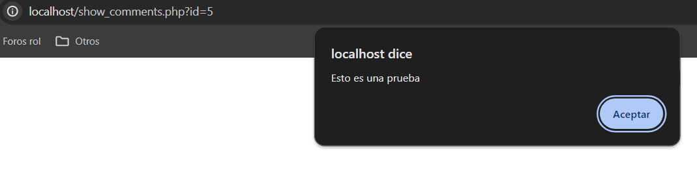
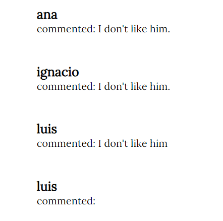
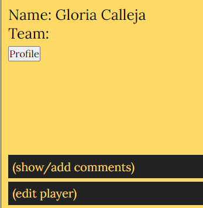

# Informe Pentesting Proyecto 8: Talent ScoutTech

## Índice

1. [Formulario de autorización de Pentesting](#form)  
   1.1 [Objetivo](#obj)  
   1.2 [Alcance](#alc)  
   1.3 [Duración](#dur)  
   1.4 [Acuerdo de Confidencialidad](#conf)  
   1.5 [Permisos solicitados](#perm)  
   1.6 [Tarifas y pagos](#pago)  
   1.7 [Índice de gravedad](#gravedad)  
   1.8 [Factores de riesgo](#factriesgo)  
   1.9 [Autorización](#auto)
3. [Resultados técnicos](#rtec)  
   2.1 [Ataque de inyección SQL (SQLi)](#sqli)  
   2.2 [Ataque de fuerza bruta para hacer inicio de sesión](#brute)  
   2.3 [Ataque de cross-site scripting (XSS)](#xss)  
   2.4 [Ataque de cross-site Request Forgery (CSRF)](#csrf)  

# Formulario de autorización de Pentesting 

**Cliente:** ACME

**Fecha de inicio de Pentesting:** 09/05/2024

**Fecha de finalización de Pentesting:** 10/05/2024

**Perito:** Eduardo de Motrico Fedriani
**DNI Perito:** 76650130P
**Contacto Perito:** 636632110
**Cualificaciones:** FPGS de Administración de Sistemas Informátios en Red, Grado de Especialización en Ciberseguridad (En curso)
**Experiencia laboral:** Medio año como técnico de incidentes informáticos para la mantenimiento de servicios en hardware y software, en A.P.D.

## Objetivo 

El objetivo es auditar la aplicación de "scouting" denominada Talent ScoutTech, para analizar el código y encontrar toda vulnerabilidad existente usando las habilidades técnicas del perito, además de proponer soluciones para dichas vulnerabilidades, para que de esa forma esté protegido ante esos posibles ataques.

## Alcance 

Su alcance está dividido en varias partes:

- Encontrar todos los puntos de entrada al sistema que no sean los establecidos por la propia plataforma
- Hacer pruebas de seguridad web para garantizar la autenticación y controles de acceso.
- Asegurar la seguridad de la base de datos, revisando su configuración y su encriptación.
- Realizar pruebas de seguridad de los puntos de acceso.

## Duración 

Todas las pruebas han de ser realizadas en un plazo de 72 horas, pudiendo realizarse todas las pruebas pertinentes en este plazo desde el momento de la firma del acuerdo.

## Acuerdo de Confidencialidad 

La información otorgada por la empresa cliente ACME, y toda información recopilada en las pruebas a la aplicación Talent ScoutTech se considera confidencial, no pudiendo divulgarse a terceros sin permiso expreso de la empresa cliente, o por orden judicial, incluyendo todos los tipos de datos posibles recopilados durante la investigación.

Fallar en el cumplimiento de la confidencialidad puede implicar mayormente la nulidad del contrato junto con posibles acciones legales.

## Permisos solicitados 

Para poder efectuar la mejora de seguridad, se ha pedido a la empresa cliente ACME el permiso expreso de modificar el código para poder efectuar dicha mejoría de seguridad, siempre notificando cuando vaya a ejecutarse las modificaciones.

## Tarifas y pagos 

La empresa cliente aceptará realizar el pago por los servicios recibidos en un acuerdo financiero que se revisará por ambas partes en una reunión, donde aparecerán todas las tarifas y precios relacionados con el servicio. Ese documento pasará a adjuntarse a este para que ambos puedan ser firmados conjuntamente en la misma reunión.

**Firma del cliente:** ACME

**Fecha de la firma:** 09/05/2024

## Índice de gravedad 

Después de revisar la aplicación en su extensión, se encontraron estos riesgos con su correspondiente valoración respectiva:

| Riesgo | Aplicación Web |
| --- | --- |
| Crítico | 1 |
| Alto | 2 |
| Medio | 1 |
| Bajo | 0 |

## Factores de riesgo 

Empleando los valores de los factores de riesgo de CVSS que estén aplicados a las vulnerabilidades, se ha podido determinar los niveles que representan los riesgos para la aplicación, además de darnos detalles para todas las vulnerabilidades encontradas:

| Nivel de Gravedad del riesgo | Puntuaciones | Descripción de la Gravedad |
| --- | --- | --- |
| Bajo | 0.0 - 3.9 | Vulnerabilidades con impacto limitado o que requieren condiciones poco probables para ser explotadas. |
| Medio | 4.0 - 6.9 | Vulnerabilidades con un impacto moderado que pueden ser explotadas bajo ciertas condiciones. |
| Alto | 7.0 - 8.9 | Vulnerabilidades con un impacto significativo y que pueden ser fácilmente explotadas. |
| Crítico | 9.0 - 10.0 | Vulnerabilidades con un impacto devastador y que pueden ser explotadas de manera trivial o sin requerir autenticación. |

## Autorización 

- Autorizo a Eduardo de Motrico Fedriani, a llevar a cabo pruebas de penetración en la página web en el ámbito de pentesting, según descrito en el objetivo.
- Autorizo a Eduardo de Motrico Fedriani a realizar todas las pruebas necesarios, siempre y cuando la integridad de la página web no se vea afectada.
- Autorizo a Eduardo de Motrico Fedriani a usar todas las herramientas que tengan disponibles para las pruebas.
- Autorizo a Eduardo de Motrico Fedriani a realizar pruebas que puedan generar positivos o alertas de seguridad en los sistemas de inicio de sesión.
- Autorizo a Eduardo de Motrico Fedriani a recopilar y analizar datos de la página web.
- Autorizo a Eduardo de Motrico Fedriani a utilizar los datos recopilados durante el pentesting únicamente con fines de evaluación de seguridad y para generar recomendaciones de mejora de seguridad
- Solicito a Eduardo de Motrico Fedriani a proporcionarme un informe detallado de los resultados del pentesting, incluyendo una descripción de las vulnerabilidades o riesgos de seguridad identificados, una evaluación de su gravedad y una recomendación de medidas de mitigación o corrección.
- Solicito a Eduardo de Motrico Fedriani a proporcionarme asistencia y asesoramiento en la implementación de las medidas de mitigación o corrección recomendadas.

# Resultados técnicos 

## Ataque de inyección SQL (SQLi) 

| Nombre de Vulnerabilidad | Inyección SQL |
| --- | --- |
| Descripción | Es usar el lenguaje SQL dentro de formularios o urls para poder ejecutar comandos y obtener información o acciones dentro de la página u aplicación, incluyendo la inserción de datos. |
| CVSS v3.0 | 8.8 |
| CVE/CWE | [Mitre](https://cwe.mitre.org/data/definitions/89) y [NIST](https://nvd.nist.gov/vuln/detail/CVE-2023-37197) |
| Riesgo | Alto |
| Impacto | Alto |
| Sistemas | La base de datos de la aplicación web, y la página web en si misma |
| Remediación | Modificar el código php para hacer que se ejecuten consultas específicas, y evitar que en los formularios entren carácteres especiales, además de revisar la autenticación del usuario y contraseña. |
| Referencias | [SQL Injection Prevention](https://powerdmarc.com/es/sql-injection-prevention/) |
| Prueba de concepto |   |

## Ataque de fuerza bruta para hacer inicio de sesión 

| Nombre de Vulnerabilidad | Fuerza bruta al inicio de sesión |
| --- | --- |
| Descripción | No se previene que el atacante pueda intentar hacer tantos intentos de autenticación como desee para intentar obtener acceso al sistema. |
| CVSS v3.0 | 9.8 |
| CVE/CWE | [Mitre](https://cwe.mitre.org/data/definitions/307.html) y [CVE](https://www.incibe.es/incibe-cert/alerta-temprana/vulnerabilidades/cve-2024-2051) |
| Riesgo | Crítico |
| Impacto | Permite al atacante obtener acceso a los datos, rompiendo la integridad, confidencialidad y veracidad de la información. |
| Sistemas | Aplicación web |
| Remediación | Debe aplicarse unas mejoras de seguridad, como el bloqueo de cuenta cuando se realizan un número de intentos de sesión. |
| Referencias | [Evitar ataques Fuerza Bruta](https://www.metacompliance.com/es/blog/cyber-security-awareness/how-to-avoid-brute-force-attacks) |
| Prueba de concepto |  |

## Ataque de Cross-site scripting (XSS) 

| Nombre de Vulnerabilidad | Cross-site scripting |
| --- | --- |
| Descripción | Existe una vulnerabilidad en la entrada durante la generación de páginas web que puede comprometer el navegador del usuario cuando un atacante con privilegios de administrador ha cambiado los valores del sistema |
| CVSS v3.0 | 4.8 |
| CVE/CWE | [CWE](https://cwe.mitre.org/data/definitions/79.html), [CVE](https://www.incibe.es/incibe-cert/alerta-temprana/vulnerabilidades/cve-2023-5985) |
| Riesgo | Medio |
| Impacto | Provoca un fallo en la integridad y confidencialidad de los datos |
| Sistemas | Página web en los comentarios de los jugadores, empleando la entrada de comentarios. |
| Remediación | Realizar la validación y filtrado de datos de entrada, implementar encabezados de seguridad,  filtrar la salida y asegurar el HTML |
| Referencias | [Evitar ataques XSS](https://www.godaddy.com/resources/es/seguridad/que-es-el-cross-site-scripting-xss-y-como-puedes-evitarlo) |
| Prueba de concepto |  |

## Ataque de Cross-site Request Forgery (CSRF) 

| Nombre de Vulnerabilidad | Cross-site Request Forgery |
| --- | --- |
| Descripción | La aplicación web no puede verificar suficientemente si una petición válida consistente fue realizada por el usuario intencionadamente. |
| CVSS v3.0 | 8.8 |
| CVE/CWE | [CWE](https://cwe.mitre.org/data/definitions/352.html) , [CVE](https://nvd.nist.gov/vuln/detail/CVE-2022-22811)|
| Riesgo | Alto |
| Impacto | Acciones no deseadas, vulneración de la seguridad, ruptura de integridad y privacidad del usuario |
| Sistemas | Página web en los comentarios de los jugadores, empleando la entrada de comentarios |
| Remediación | Usar tokens CSRF, usar la cabacera de referencia |
| Referencias | [Evitar ataques CSRF](https://kinsta.com/es/blog/ataque-csrf/), [Evitar ataques CSRF 2](https://learn.microsoft.com/es-es/aspnet/web-api/overview/security/preventing-cross-site-request-forgery-csrf-attacks) |
| Prueba de concepto |  |
